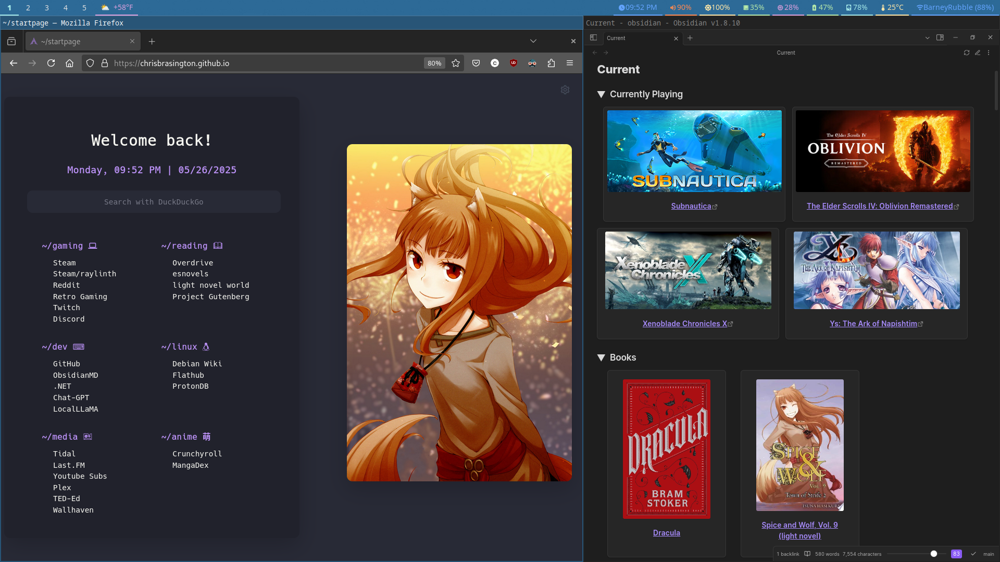

# dotfiles

  

  

## Summary
- Wallpaper: [Upload](https://github.com/chrisbrasington/dotfiles/blob/main/wallpaper/current.png) | [Credit: 邦乔彦](https://www.pixiv.net/en/users/10746425)
- Waybar: [Arkboi's Sway](https://github.com/arkboix/sway/tree/main/files/.config/waybar
)
- Wofi: [Pastel](https://github.com/joao-vitor-sr/wofi-themes-collection/tree/main
)
- Fonts: [Firacode, SauceCodePro](https://www.nerdfonts.com/font-downloads)
- Homepage: [Fork of druxorey/startpage](https://github.com/druxorey/startpage)
- Cursor: [Bibata](https://github.com/ful1e5/Bibata_Cursor)
- [Obsidian.md](https://obsidian.md/) Themes: [custom modified fork of dataviewjs + minimal cards css](https://forum.obsidian.md/t/snippet-so-you-can-use-dataview-cards-from-minimal-theme-in-any-theme/56866)
- Game: [Pacific Drive](https://store.steampowered.com/app/1458140/Pacific_Drive/)
- Other: [Dotfiles](https://github.com/chrisbrasington/dotfiles)