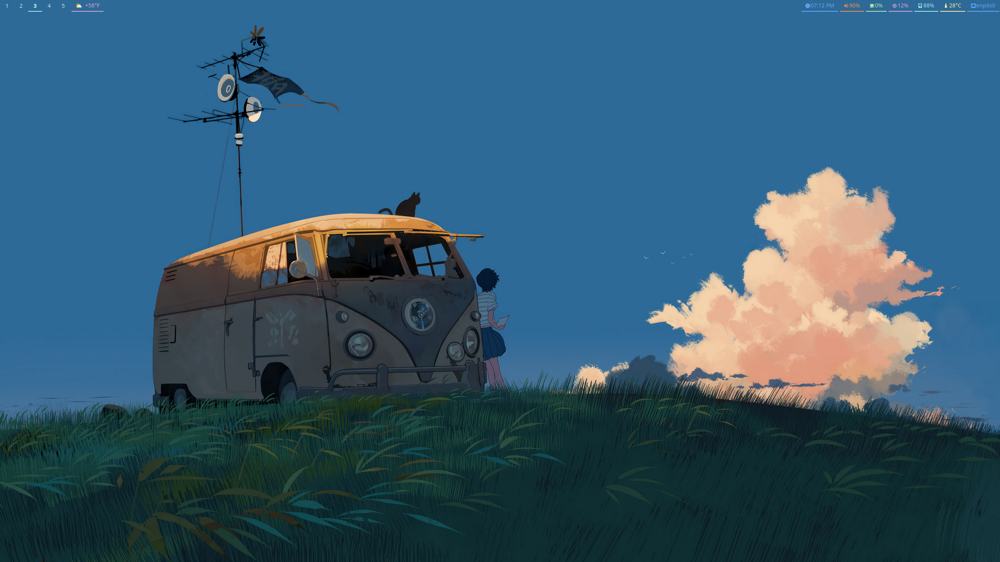

# dotfiles

  

  

## Fonts used
https://www.nerdfonts.com/font-downloads

- FiraCode
- SauceCodePro

## Waybar modified from..
ARKBOI'S SWAY
https://github.com/arkboix/sway/tree/main/files/.config/waybar

## Wofi modified from..
wofi-themes-collection
`MOD+space`
https://github.com/joao-vitor-sr/wofi-themes-collection/tree/main

## Wallpaper
邦乔彦
https://www.pixiv.net/en/users/10746425

## Cursor
https://github.com/ful1e5/Bibata_Cursor

## Summary
- Wallpaper: [Upload](https://github.com/chrisbrasington/dotfiles/blob/main/wallpaper/current.png) | [Credit: 邦乔彦](https://www.pixiv.net/en/users/10746425)
- Waybar: [Arkboi's Sway](https://github.com/arkboix/sway/tree/main/files/.config/waybar
)
- Wofi: [Pastel](https://github.com/joao-vitor-sr/wofi-themes-collection/tree/main
)
- Fonts: [Firacode, SauceCodePro](https://www.nerdfonts.com/font-downloads)
- Other: [Dotfiles](https://github.com/chrisbrasington/dotfiles)